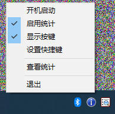
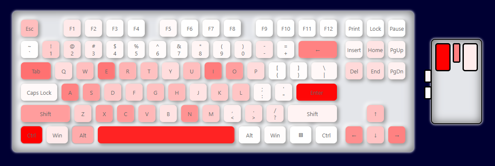

# KeySight - 键盘鼠标频次统计工具

[](https://www.microsoft.com/windows)
[](https://visualstudio.microsoft.com/)
[](https://www.gnu.org/licenses/gpl-3.0)
[English](README_EN.md)

KeySight 是一个轻量级的 Windows 桌面应用程序，用于记录和分析键盘和鼠标的使用情况，并通过精美的热力图可视化展示按键热度。

## ✨ 主要特性

- **📊 实时统计**: 自动统计键盘和鼠标按键的使用频率
- **🎨 热力图可视化**: 基于 HTML 的交互式热力图，直观显示按键频率
- **🔔 实时显示**: 按键时显示悬浮提示，支持 Windows 徽标等特殊键，
- **⚙️ 高度可配置**: 支持开机启动(需要管理员权限)、快捷键控制、统计开关等功能
- **🔒 隐私保护**: 所有数据本地存储(仅按键次数)，不上传任何个人信息
- **🌐 跨平台查看**: 支持本地和在线查看统计结果

## 🖼️ 界面预览


*点击托盘图标，弹出配置菜单*

*交互式键盘热力图，颜色越红表示使用频率越高*

## 🚀 快速开始

### 系统要求

- Windows 10 或更高版本

### 安装方法

#### 方法一：下载预编译版本
1. 前往 [Releases 页面](https://github.com/keroslee/KeySight/releases)
2. 下载最新版本的 `KeySight.zip`
3. 解压到任意目录
4. 运行 `KeySight.exe`

#### 方法二：从源代码编译
```bash
# 克隆仓库
git clone https://github.com/keroslee/KeySight.git
cd KeySight
```
使用 Visual Studio 2022 打开 KeySight.sln

### 使用方法

1. **首次运行**: 程序启动后会在系统托盘中显示图标
2. **查看统计**: 左/右键点击托盘图标 → "查看统计"
3. **配置选项**:
   - **启用统计**: 开始/停止记录按键数据
   - **显示按键**: 按键时显示实时提示
   - **开机启动**: 设置程序随系统启动
   - **设置快捷键**: 配置显示/隐藏热键

## ⚙️ 配置文件
程序会在同目录下生成以下文件：

- `KeySight.ini` - 程序配置，删除该文件即可恢复默认配置
- `KeySight.txt` - 统计数据，累计次数，删除即重置
- `KeySight.log` - 运行日志

### 配置示例
```ini
[Config]
boot=0
stats=1
show=1
hotkey=0
lang=zh-CN
view_url=https://keros.im/kb.htm
[zh-CN]
lan_app=按键统计
lan_enable=启用
lan_disable=禁用
lan_onboot=开机启动
lan_stat=启用统计
lan_show=显示按键
lan_hotkey=设置快捷键
lan_exit=退出
lan_total=总按键数:
lan_hotkey_tip=按下快捷键设置/按Del键删除
lan_hotkey_title=设置快捷键
lan_suc=成功
lan_fai=失败
lan_dup=程序已经在运行中，查看任务栏中的图标
lan_view=查看统计
lan_viewing=正在打开网页，查看按键热度
lan_view_failed=打开网页失败
lan_view_success=打开网页成功
```

## 🌐 语言配置
KeySight 支持多语言界面，可以根据用户系统语言自动切换，也支持手动配置语言设置。

### 支持的语言
- **简体中文** (zh-CN) - 简体中文
- **English** (en-US) - 英语
- **系统自动检测** - 根据系统语言设置自动选择
- **添加其他语言** - 运行一次程序，初始化ini文件，修改lang，添加相应的配置块，重启程序
- **手动指定语言** - 在ini文件中修改lang，重启程序

## 🛠️ 开发指南

### 构建环境
- Visual Studio 2022
- Windows SDK
- C++17 标准

### 依赖项
- Windows API
- GDI+ (图形绘制)
- Raw Input API (输入捕获)

### 编译步骤
1. 使用 Visual Studio 2022 打开 `KeySight.sln`
2. 设置编译配置为 `Release`
3. 生成解决方案 (Ctrl+Shift+B)

## 🎯 功能详解

### 键盘统计
- 记录所有标准键盘按键
- 区分左右修饰键 (Shift, Ctrl, Alt, Win)
- 支持功能键和数字小键盘

### 鼠标统计
- 左右键点击统计
- 滚轮使用统计
- 侧键 (X1/X2) 统计

### 可视化特性
- 渐变热力图颜色
- 鼠标悬停显示具体数值
- 响应式设计适配不同屏幕
- 动态隐藏未使用的小键盘区域

## 🔗 Listary5 集成

KeySight 扩展了 [Listary5](https://www.listary.com/) 工具条的触发形式

### 集成特性
- **⚡ 无缝切换**: 敲击左❖键，直接触发 Listary5 工具条。右❖键功能不变。
- **🔄 自动热键检测**: 自动读取 Listary5 的配置文件，获取其热键设置

### 工作原理
KeySight 通过解析 Listary5 的配置文件 (`Preferences.json`) 来获取其热键设置：

```json
{
  "hotkey": {
    "main": 12345
  }
}
```

## 🔧 故障排除

### 常见问题

**Q: 程序无法启动或立即退出**
A: 检查是否已有实例在运行，程序仅支持单实例运行

**Q: 无法开机启动**
A: 由于需要在Windows计划任务中创建KeySight任务，所以需要管理员权限才能启用该功能。检查程序文件所在路径，是否包含空格等特殊字符

**Q: 热力图页面无法打开**
A: 检查默认浏览器设置和网络连接。或者随便敲几下键盘/鼠标，重试。初次使用，KeySight.txt文件还没有生成(只有记录到10个按键以上才会开始写入)

**Q: 被杀毒软件误报**
A: 将程序添加到杀毒软件的白名单中

### 日志文件
程序运行日志保存在 `KeySight.log` 中，遇到问题时可以查看此文件。

## 📄 许可证
本项目采用 **GNU General Public License v3.0** - 详见 [LICENSE](https://www.gnu.org/licenses/gpl-3.0.html) 。

## 🙏 致谢
- 感谢 [LC044/TraceBoard](https://github.com/LC044/TraceBoard/blob/main/server/static/index.html)
- 感谢 AI 和 我自己👻

## 📞 联系信息
- 项目主页: [https://github.com/keroslee/KeySight](https://github.com/keroslee/KeySight)
- 问题反馈: [GitHub Issues](https://github.com/keroslee/KeySight/issues)
- 邮箱: keros@keros.im

---
**注意**: 本工具仅用于个人生产力分析和习惯改善，请勿用于监控他人设备。使用本工具即表示您同意自行承担所有相关责任。